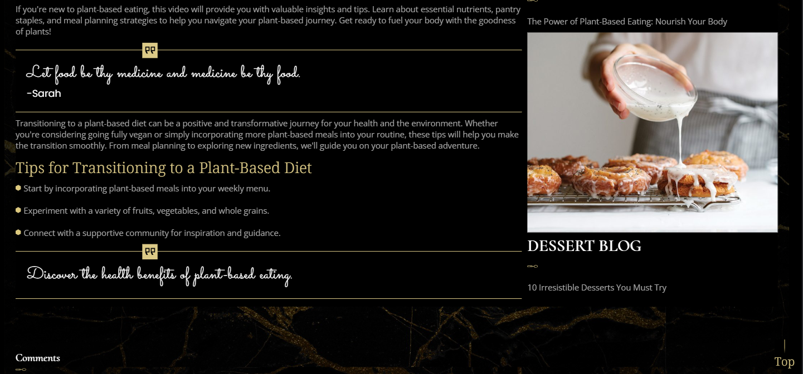

# Wine And Dine

Welcome to Wine And Dine, a personal project crafted with Firebase and Svelte Kit to bring you an immersive and delightful restaurant experience. Wine And Dine combines the power of Firebase's robust backend infrastructure with the lightweight and intuitive Svelte Kit framework to create a seamless and dynamic web application.

## Tech Stack

**Client:** Svelte-Kit

**Server:** Firebase

## Run Locally

Clone the project

```bash
  git clone git@github.com:Armaan-Singh-Dhillon/Restaurant-Website.git
```

Go to the project directory and install the dependencies

```bash
  npm install
```

Run the development server

```bash
  npm run dev
```

## Project Deployed On Vercel

To access this project

[Click Here To See The Deployed Project](https://restaurant-website-6k7g6oil6-armaan-singh-dhillon.vercel.app)

## Screenshots





## Color Reference

| Color            | Hex                                                              |
| ---------------- | ---------------------------------------------------------------- |
| Background Color |  #000          |
| Borders          |  #dcc87a |
| Text Color       |  #fff          |

## Features

- Built using Svelte and Firebase technologies
- Utilizes Svelte routing animation for smooth transitions between pages
- Optimized build using Vite for improved performance and fast loading times
- Firebase Storage bucket for storing and serving images and other media files
- Firestore SDK for real-time data synchronization and efficient data management
- Firestore Auth for secure user authentication and authorization
- Svelte transitions for creating visually appealing animations and effects
- Dynamic routing to handle different page layouts and content based on user interaction
- Modern UI design with CSS and grids for a visually appealing and user-friendly experience

## Support

For support, email dhillonarmaan2004@mail.com

## Developer

- [@Armaan-Singh-Dhillon](https://github.com/Armaan-Singh-Dhillon)
